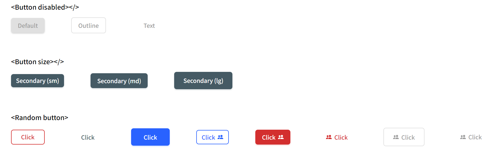

<!-- TABLE OF CONTENTS -->

## Table of Contents

- [Overview](#overview)
- [Built With](#built-with)
- [Features](#features)

<!-- OVERVIEW -->

## Overview

This project is a reusable button component for React developers. It provides several customization options, such as color styles, button variants, and styles for the disabled status. Developers can also disable the shadow effect on the button. [demo](https://button-component-sand.vercel.app/)

## Features

- Customizable color styles
- Button variants (e.g., outline, text)
- Style for disabled status
- Option to disable shadow effect

## Built With

- [React](https://react.dev/?ref=jonas.io)
- [Styled Components](https://styled-components.com/)

  This application/site was created as a submission to a [DevChallenges](https://devchallenges.io/challenges) challenge. The [challenge](https://devchallenges.io/challenges/ohgVTyJCbm5OZyTB2gNY) was to build an application to complete the given user stories.
